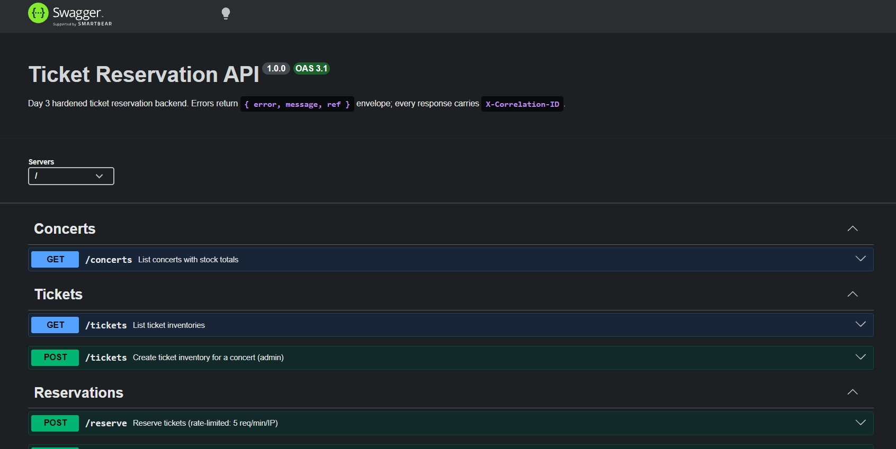

# Ticket Reservation API (Bootcamp Assignment)

Concert ticket reservation bootcamp backend assignment built with Node.js + TypeScript + Express + TypeORM (SQLite).

## Features

- List concerts and stock: `GET /concerts`
- Ticket inventory management: `GET /tickets`, `POST /tickets`
- Reserve tickets (temporary hold): `POST /reserve` (rate-limited)
- Purchase
  - reservation purchase: `POST /purchase`
  - direct purchase (optimistic): `POST /purchase/optimistic`
  - direct purchase (pessimistic / SQLite writer lock): `POST /purchase/pessimistic`
- Cleanup expired reservations
  - manual: `POST /cleanup`
  - background: runs every minute in-process
- Swagger UI: `GET /api-docs`

## Tech Stack

- Node.js (>= 20)
- TypeScript (strict)
- Express
- TypeORM
- SQLite (`better-sqlite3`)
- Zod (validation)
- Pino (JSON logs + AsyncLocalStorage correlationId)
- Redis (rate limiting store via `rate-limit-redis`, fallback supported)
- Swagger UI (`swagger-ui-express`) + Zod OpenAPI (`@asteasolutions/zod-to-openapi`)

## Project Structure

```
src/
  entities/        # TypeORM entities (Concert, Ticket, Reservation)
  migrations/      # DB migrations (synchronize=false)
  routes/          # Express routers (thin controllers)
  services/        # Business logic
  validations/     # Zod schemas (.strict())
  middleware/      # correlation-id, logger, validate, error-handler, rate-limit
  dtos/            # Response DTO mappers
  lib/             # logger, request-context, errors, redis, openapi, transaction
  jobs/            # background jobs (cleanup cron)
  app.ts           # Express wiring (middleware order)
  server.ts        # Bootstrap + graceful shutdown
  seed.ts          # Sample data seeder
```

## Overview (What I Learned)

- Indexing strategy for hot paths (concertId + reservation status/expiry)
- Transactions and atomic updates to prevent overselling
- Concurrency strategies (optimistic vs pessimistic) on SQLite
- API validation with consistent error envelopes

## API Routes

| Method | Path | Description |
| --- | --- | --- |
| GET | `/` | Health check |
| GET | `/concerts` | List concerts |
| GET | `/tickets` | List ticket inventory |
| POST | `/tickets` | Create ticket inventory |
| POST | `/reserve` | Reserve tickets (hold stock) |
| POST | `/purchase` | Purchase a reservation by `reservationId` |
| POST | `/purchase/optimistic` | Direct purchase (optimistic) |
| POST | `/purchase/pessimistic` | Direct purchase (pessimistic) |
| POST | `/cleanup` | Cleanup expired reservations |
| GET | `/api-docs` | Swagger UI |

## Setup (Local)

```bash
npm install
cp .env.development .env

npm run migration:run
npm run seed
npm run dev

curl http://localhost:3000/
```

## Setup (Docker)

```bash
docker compose up --build
curl http://localhost:4000/
```

## Setup (EC2 Production)

```bash
cp .env.production.example .env.production
docker compose -f docker-compose.prod.yml up -d --build
```

Full guide: `docs/deploy-ec2.md`

## Submission

- Stress Test Report: `docs/stress-test-report.md`
- Swagger UI screenshot 
  - `http://localhost:4000/api-docs`
  - 
- Logs Test Report: `docs/stress-test-report.md`
